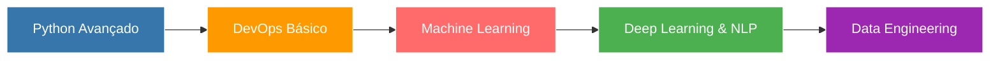

# 👋 Olá! Eu sou o Pedro Vergueiro

<div align="center">
  
  
  
</div>

## 🚀 Sobre Mim

Estudante de **Engenharia de Software** na UNINTER, apaixonado por **dados, backend e inteligência artificial**. Certificado em **Python Fundamentals** e **Python Backend Developer** pela DIO.

Estou em busca da **primeira oportunidade profissional** como desenvolvedor júnior ou estagiário, com foco em Backend, Análise de Dados, Ciência de Dados e IA.

```python
class PedroVergueiro:
    def __init__(self):
        self.name = "Pedro Lucas Vergueiro Felício da Silva"
        self.role = "Backend Developer | Data Enthusiast"
        self.education = "Engenharia de Software @ UNINTER"
        self.interests = ["Backend", "Data Analysis", "Data Science", "AI/ML", "Data Engineering"]
        self.currently_learning = ["Python (aprofundamento)", "DevOps básico", "Machine Learning", "NLP"]
        self.looking_for = "Estágio ou Vaga Júnior"
    
    def say_hi(self):
        print("Vamos construir algo incrível juntos! 🚀")

me = PedroVergueiro()
me.say_hi()
```

---

## 🛠️ Stack Tecnológica

### Linguagens


### Frameworks & Bibliotecas


### Banco de Dados


### Ferramentas


---

## 📊 Estatísticas do GitHub

<div align="center">
  
  
  
  
  
  

</div>

---

## 🎯 Projetos em Destaque

### 🤖 [Sentiment Analysis API](https://github.com/pedrovergueiro/sentiment-analysis-fastapi)
> API simples para análise de sentimento usando Machine Learning e NLP

**Tech Stack:** Python, FastAPI, Transformers, NLP  
**Objetivo:** Demonstrar integração de modelos de ML em APIs REST

---

### 📊 [DATAOPS Portfolio](https://github.com/pedrovergueiro/DATAOPS-portifolio)
> Processamento e visualização básica de dados

**Tech Stack:** Python, Pandas, SQL  
**Objetivo:** Manipulação e análise exploratória de dados

---

### ✅ [Task API (FastAPI)](https://github.com/pedrovergueiro/task-api-fastapi)
> API CRUD preparada para integrar modelos de Machine Learning

**Tech Stack:** Python, FastAPI, SQLite  
**Objetivo:** Arquitetura backend escalável para projetos de ML

---

### 📝 [Feedback System](https://github.com/pedrovergueiro/feedback-com-python-e-sql-portifolio)
> Pipeline simples de ETL e análises básicas

**Tech Stack:** Python, SQL, Pandas  
**Objetivo:** Demonstrar conhecimento em ETL e análise de dados

---

## 🌱 O que estou aprendendo



🔹 **Foco atual:** Aprofundar conhecimentos em Python e fundamentos de Machine Learning  
🔹 **Próximos passos:** DevOps básico (Docker, CI/CD) e Engenharia de Dados  
🔹 **Meta:** Atuar com IA, Ciência de Dados ou Engenharia de Dados

---

## 💼 Objetivo Profissional

🎯 **Buscando:** Estágio ou Vaga Júnior em:
- Backend Development (Python/FastAPI)
- Análise de Dados
- Ciência de Dados
- Engenharia de Dados
- Machine Learning / IA

📌 **Diferenciais:**
- Certificações em Python pela DIO
- Portfólio com projetos práticos de ML e APIs
- Experiência com NLP e análise de sentimentos
- Conhecimento em ETL e processamento de dados

---

## 📫 Vamos Conversar?

Estou sempre aberto a novas oportunidades, colaborações e conversas sobre tecnologia!

<div align="center">

[](https://www.linkedin.com/in/pedro-vergueiro)
[](mailto:pedrolv.fsilva@gmail.com)
[](https://github.com/pedrovergueiro)

</div>

---

## 📈 Atividade Recente

<!--START_SECTION:activity-->
<!--END_SECTION:activity-->

---

<div align="center">
  
  ### 💡 "A jornada de mil milhas começa com um único passo" 
  
  
  
  ⭐️ **Gostou do meu perfil?** Dê uma estrela nos projetos!
  
</div>
